# Что это `new Date()` в JavaScript 
###### new Date() в JavaScript - это конструктор, который создает новый объект Date, представляющий определенную дату и время.

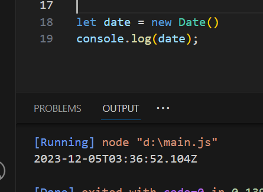

Методы объекта Date - get(): 

Приведенные выше методы get возвращают местное время.

Методы get возвращают информацию из существующих объектов даты.

Время в объекте date не совпадает с текущим временем.

1. getDate() - возвращает день месяца (от 1 до 31)
2. getMonth() - возвращает месяц (`JavaScript считает месяцы от 0 до 11. Январь равен 0. Декабрь равен 11.`)
3. getFullYear() - возвращает год (четырехзначное число)
4. getHours() - возвращает час (от 0 до 23)
5. getMinutes() - возвращает минуты (от 0 до 59)
6. getSeconds() - возвращает секунды (от 0 до 59)
7. getMilliseconds() - возвращает миллисекунды (от 0 до 999)
8. getTime() - возвращает количество миллисекунд, прошедших с 1 января 1970 года

Примери:

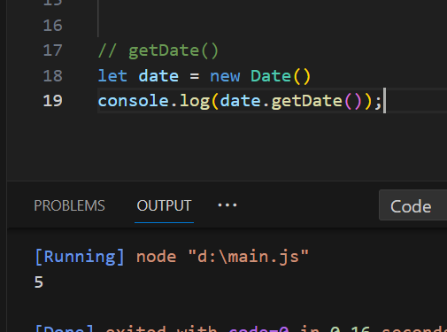

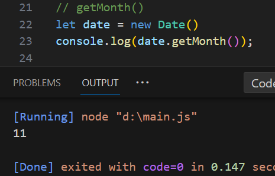

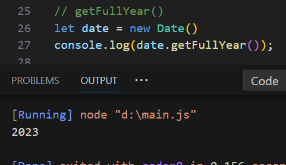

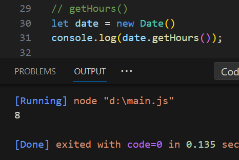

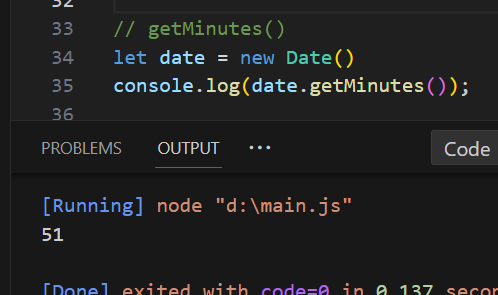

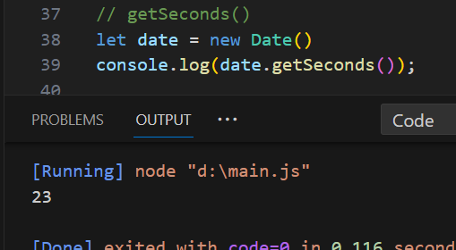

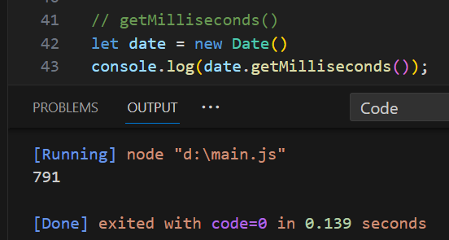

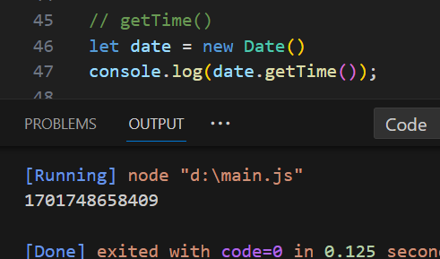

Методы объекта Date - sets(): 

Методы Set Date позволяют задавать значения даты (годы, месяцы, дни, часы, минуты, секунды, миллисекунды) для объекта даты. Методы Set Date используются для установки части даты:

1. setDate() - устанавливает день месяца (от 1 до 31)
2. setMonth() - устанавливает месяц (`JavaScript считает месяцы от 0 до 11. Январь равен 0. Декабрь равен 11.`)
3. setFullYear() - устанавливает год (четырехзначное число)
4. setHours() - устанавливает час (от 0 до 23)
5. setMinutes() - устанавливает минуты (от 0 до 59)
6. setSeconds() - устанавливает секунды (от 0 до 59)
7. setMilliseconds() - устанавливает миллисекунды (от 0 до 999)

Примери:

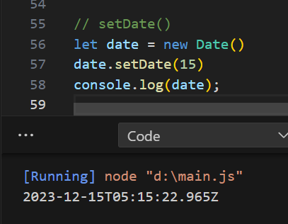

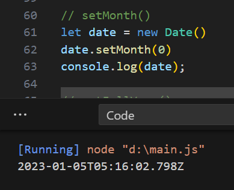

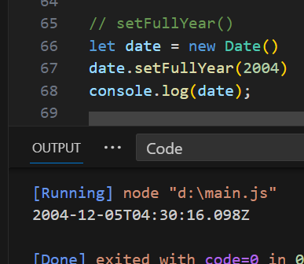

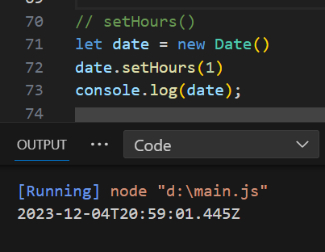

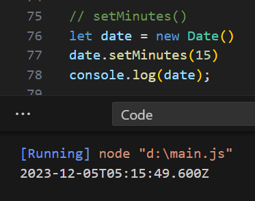

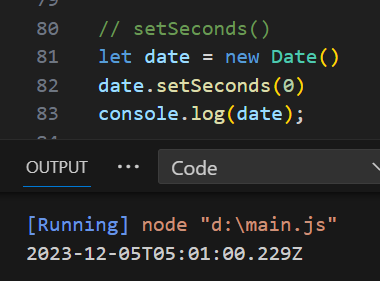

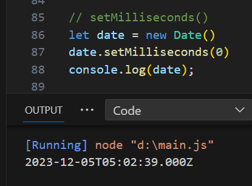